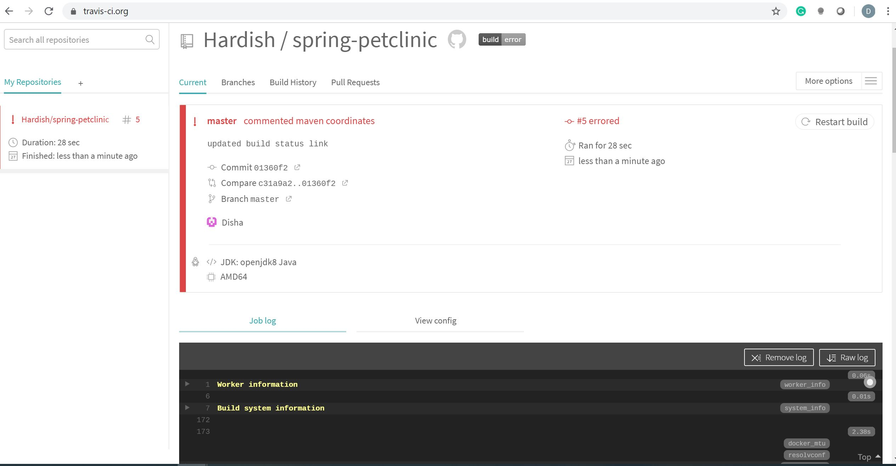
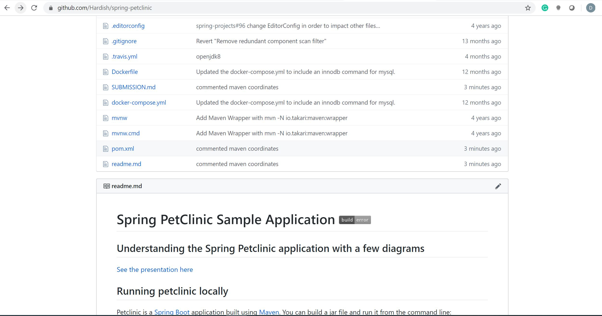
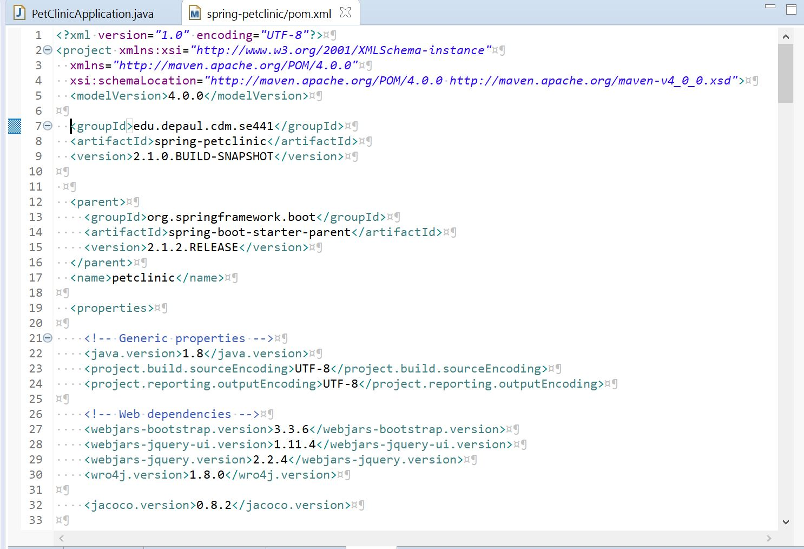
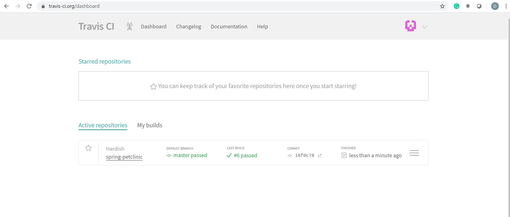
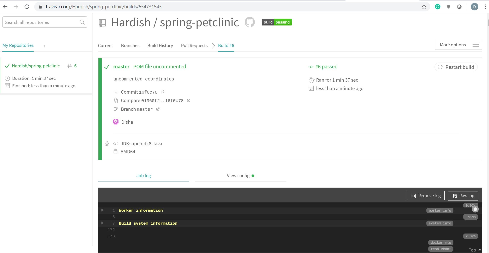
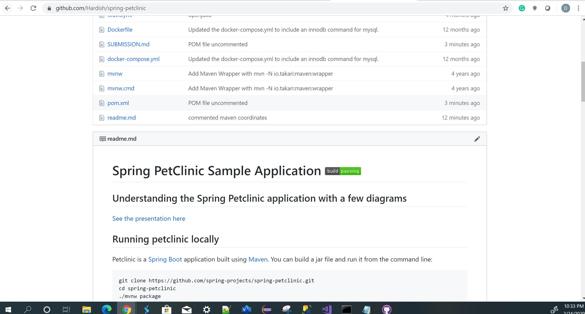

1)(5 pts) Your Github account showing that is has been forked from the depaulcdm/springpetclinic repository.

2)(5 pts) Your Travis CI dashboard showing a successful first build.
 

 

3)(5 pts) The section of the POM file showing the coordinates after you’ve changed them.

4)(5 pts) Your Travis CI dashboard showing a successful build after your change of the group ID.
 

5)(5 pts) The section of the POM file showing the coordinates after you’ve commented them out. 

6)(5 pts) Your Travis CI dashboard showing the unsuccessful build after the breaking change. 

7)(5 pts) Your Github repository with the readme.md file selected showing the build failed status after the Travis CI build fails. 

8)(5 pts) The section of the POM file showing the coordinates after you’ve fixed them.  

9)(5 pts) Your Travis CI dashboard showing the successful build after the breaking change has been fixed.

10)(5 pts) Your Github repository with the readme.md file selected showing the build success status after the Travis CI build has recovered. 
